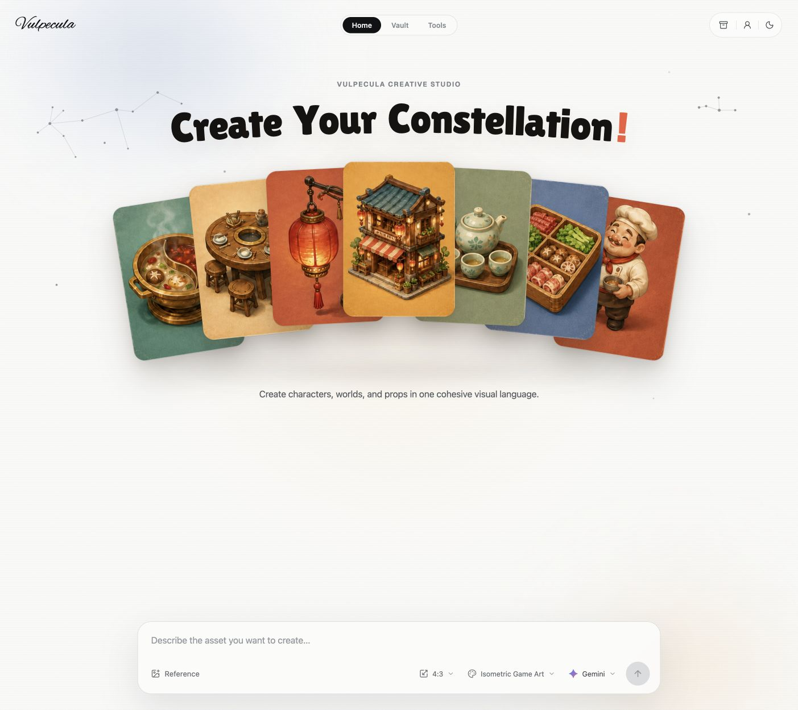

# Vulpecula

[简体中文](README.md) | [English](README.en.md)

### An AI image workspace you can run yourself

**Connect your own model providers. Turn ideas into images, and images into usable assets.**

Vulpecula is for individual creators, indie developers, and anyone who regularly creates visual assets. Run it on your computer or server, configure your own API keys, and bring prompts, styles, image generation, asset management, and basic editing into one workspace.

It is an extensible image generation application framework powered by the model services you connect. The current interface and examples focus on game art, including characters, props, environments, and isometric illustrations. Prompts and style presets also let you adapt it to other kinds of image creation.

> Bring your own keys. Create in your own workspace.



## Features

- **Generate images**: Access Gemini, FLUX, Volcengine Seedream, and MiniMax through one interface, with real generation results and clear error messages.
- **Manage styles**: Choose, edit, and create style presets that append reusable art direction to your prompts.
- **Organize assets**: Save generated images to the Vault, browse folders, search, preview, rename, and download your work.
- **Process images**: Normalize pixel grids, remove background colors, and export PNG, JPG, or WebP files in your browser.
- **Stage and recover**: Keep processed images in the staging tray for 30 days, followed by 15 days in the trash. Cleanup runs when tray data is accessed.
- **Set preferences**: Switch between light and dark themes, choose a default model and aspect ratio, and manage style presets.

Typical workflow: **Choose a model and style → Write a prompt → Generate → Download or save to the Vault → Process in the Toolkit.**

## Quick start

You need **Node.js 22.13 or later**, npm, and a working API key for at least one model provider to generate images. You can browse sample assets and use the local image tools without an API key.

```bash
git clone https://github.com/PixelCookie-zyf/Vulpecula.git
cd Vulpecula/frontend
npm ci
cp .dev.vars.example .dev.vars
```

Add the keys you want to use to `.dev.vars`, then start the app:

```bash
npm run dev
```

Open the [local workspace](http://localhost:3000). Restart the development server after changing `.dev.vars`.

### Model configuration

Each provider is configured independently. Add only the keys you need. These are the defaults used by this project, not a complete list of models available from each provider.

| Model in the UI | Environment variable | Default model | API keys / documentation |
| --- | --- | --- | --- |
| Gemini | `GEMINI_API_KEY` | `gemini-2.5-flash-image` | [Google AI Studio](https://aistudio.google.com/apikey) |
| FLUX | `FLUX_API_KEY` | `flux-2-pro` | [Black Forest Labs](https://api.bfl.ai) |
| Seedream | `ARK_API_KEY` | `doubao-seedream-4-0-250828` | [Volcengine Ark console](https://console.volcengine.com/ark) |
| MiniMax | `MINIMAX_API_KEY` | `image-01` | [MiniMax China platform](https://platform.minimaxi.com) |

**Volcengine Seedream** uses `https://ark.cn-beijing.volces.com` by default. Enable the corresponding model in the Ark console. Set `ARK_MODEL` if you need a specific model or inference endpoint ID. See the [official image generation API documentation](https://api.volcengine.com/api-docs/view?action=ImageGenerations&serviceCode=ark&version=2024-01-01). Older preferences saved as `seedance` remain compatible and resolve to Seedream. This project does not currently generate video.

**MiniMax** uses the mainland China endpoint, `https://api.minimaxi.com`, as described in the [China platform image generation documentation](https://platform.minimaxi.com/docs/guides/image-generation). For an international platform key, also set `MINIMAX_BASE_URL=https://api.minimax.io`. Your key's region, model permissions, and available balance must match the service you use. Subscriptions or trial credits for other products may not cover the image API.

Optional overrides:

```dotenv
# Uncomment as needed. Do not append /v1 or /api/v3 to a base URL.
# GEMINI_MODEL=gemini-2.5-flash-image
# FLUX_MODEL=flux-2-pro
# ARK_BASE_URL=https://ark.cn-beijing.volces.com
# ARK_MODEL=doubao-seedream-4-0-250828
# MINIMAX_BASE_URL=https://api.minimaxi.com
```

### Local proxy (optional)

The app connects directly to model providers by default. If your network requires an HTTP proxy, use the included development forwarder.

Start the forwarder in a separate terminal, replacing the port with your own HTTP proxy port:

```bash
cd frontend
FORWARDER_PROXY_HOST=127.0.0.1 FORWARDER_PROXY_PORT=7890 npm run forwarder
```

Then add the following to `.dev.vars` and restart the development server:

```dotenv
DEV_FORWARDER_URL=http://127.0.0.1:8787
```

The forwarder listens only on the local machine. Leave `DEV_FORWARDER_URL` unset if you do not need a proxy, and do not carry this local setting into a deployed environment.

## Vault and data storage

The current version stores your workspace data locally:

| Data | Location |
| --- | --- |
| Vault images, folders, styles, and preferences | localStorage in the current browser |
| Staging tray and trash images | IndexedDB in the current browser |
| Model API keys | Local `.dev.vars` or secrets in the server's deployment environment |

The Vault starts with seven sample assets. New images are added to the **Generated** folder without replacing existing images. If you clear the library, it stays empty. Use **Settings → Sample library → Restore sample assets** to add the samples again without overwriting your saved work.

**Browser storage is not a backup.** Switching browsers or domains, clearing site data, or using private browsing can make your assets unavailable. Vault storage is limited, and large images can fill it quickly. Download important work. If saving fails, the generated image preview and download option remain available.

## Privacy, costs, and sharing

- Image generation sends your prompt to the selected provider through `/api/generate`. The provider's data handling policies and pricing still apply.
- API keys are read by the server and are not sent to the browser through the UI. Do not put them in `NEXT_PUBLIC_*` variables.
- The current Toolkit processes images in the browser and does not upload imported images to model providers.
- This project does not include image generation credits. Usage is billed to the account associated with the configured key. Closing the generation dialog does not guarantee that the provider stops processing or charging for the request.
- **There is currently no authentication for multiple users, permission isolation, usage quota enforcement, or rate limiting on the server.** The Account page is a local workspace overview, not a cloud account.
- Run it for personal use or within a controlled private environment. Before sharing a deployment, add authentication, access controls, rate limits, and spending safeguards. Anyone who can reach the generation endpoint may be able to consume the deployment owner's API credits.
- Keep `.dev.vars`, local environment files, build caches, and backup archives out of Git commits.

## Development and extension

The frontend uses **React, TypeScript, and the Next.js App Router**, built with **vinext / Vite** and adapted for Cloudflare Workers. No separate database is required to try it locally.

```text
frontend/
├── app/
│   ├── api/generate/route.ts   # Provider adapters
│   ├── page.tsx               # Prompt and generation workspace
│   ├── vault-store.ts         # Library reads, updates, and sample recovery
│   ├── vault-save.ts          # Image saving and format helpers
│   ├── vault/                 # Asset library
│   ├── tools/                 # Local image tools
│   ├── style-presets.ts       # Default styles and prompt composition
│   └── settings/              # Preferences and local data management
├── public/                    # Sample images, icons, and social preview
├── scripts/                   # Optional development forwarder
└── tests/                     # Vault and generation route regression tests
```

Add styles directly in Settings, or edit `app/style-presets.ts` to distribute new defaults. Adding a provider requires updating the generation route, the model picker on the home page, and the default model options in Settings.

```bash
cd frontend
npm test
npm run typecheck
npm run lint
npm run build
```

Automated tests use local fixtures and mocked provider responses, so they do not consume generation credits. Testing against real providers requires your own account and available quota.

### Deploying to Cloudflare Workers

`npm run build` produces the Worker, static assets, and `dist/server/wrangler.json`. Before deploying with your own Cloudflare account, put the access and spending safeguards described above in place. Do not expose a generation endpoint with configured API keys to the public without protection.

```bash
cd frontend
npm run build
npx wrangler deploy --config dist/server/wrangler.json
npx wrangler secret put ARK_API_KEY --config dist/server/wrangler.json
# Set other provider secrets as needed. Do not upload .dev.vars.
```

The repository retains its Sites build configuration. If you use Sites hosting, link a project in your own environment and configure server secrets separately. The source repository does not include a running cloud service, provider accounts, or generation credits.

## Current limitations

This version focuses on generating a single image from a text prompt and organizing personal assets. Style presets are prompt fragments and do not guarantee consistent characters across images. Pixel tools process images locally. Background removal uses colors and regions connected to image edges, rather than AI subject segmentation. Output dimensions are subject to provider constraints, so not every model will return the exact pixel size selected in the UI.

Generation from reference images, video generation, batch queues, collaboration, cloud asset synchronization, and a complete account system are not implemented in this version.
