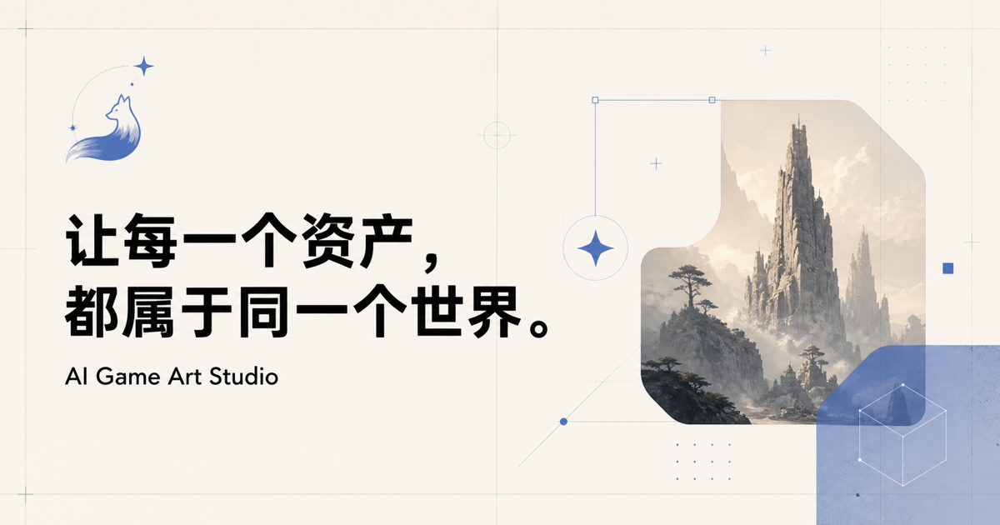

# Vulpecula

### 自部署的 AI 图片创作工作台

**接入自己的模型服务，把灵感变成图片，再把图片整理成可用的素材。**

Vulpecula 面向个人创作者、独立开发者和需要反复制作视觉素材的人。你可以在自己的电脑或服务器上运行它，配置自己的 API Key，在同一个工作台里完成提示词编写、风格选择、图片生成、素材管理和基础处理。

它是一个可扩展的图片生成应用框架，生成能力来自你接入的模型服务。目前的界面与示例以游戏美术为主，适合角色、道具、场景、等距插画，也可以通过提示词和风格预设用于其他图片创作。

> Bring your own keys. Create in your own workspace.



## 能做什么

- **生成图片**：统一接入 Gemini、FLUX、火山 Seedream 和 MiniMax；显示真实生成结果与失败原因。
- **管理风格**：选择、编辑和新增风格预设，将固定的美术描述附加到提示词中。
- **整理素材**：把生成结果存入 Vault，按文件夹浏览、搜索、预览、重命名和下载。
- **处理图片**：在浏览器内进行像素网格整理、背景颜色去除以及 PNG / JPG / WebP 导出。
- **暂存与回收**：处理结果可放入暂存盘，暂存 30 天后进入回收站，再保留 15 天；过期清理在访问暂存盘时执行。
- **个人偏好**：切换明暗主题，设置默认模型、画幅和风格。

推荐流程：**选择模型和风格 → 输入描述 → 生成 → 下载或保存到 Vault → 在 Toolkit 中处理。**

## 快速开始

需要 **Node.js 22.13 或更高版本**、npm，以及至少一家模型服务的可用 API Key。没有 Key 也可以浏览示例素材和使用本地图片工具。

```bash
git clone https://github.com/PixelCookie-zyf/Vulpecula.git
cd Vulpecula/frontend
npm ci
cp .dev.vars.example .dev.vars
```

在 `.dev.vars` 中填入需要使用的 Key，然后启动：

```bash
npm run dev
```

打开 [本地工作台](http://localhost:3000)。修改 `.dev.vars` 后需要重启开发服务。

### 模型配置

各模型独立配置，只填你需要的服务即可。下面是本项目的默认路由配置，并非供应商的完整模型列表。

| 界面模型 | 环境变量 | 默认模型 | Key / 文档入口 |
| --- | --- | --- | --- |
| Gemini | `GEMINI_API_KEY` | `gemini-2.5-flash-image` | [Google AI Studio](https://aistudio.google.com/apikey) |
| FLUX | `FLUX_API_KEY` | `flux-2-pro` | [Black Forest Labs](https://api.bfl.ai) |
| Seedream | `ARK_API_KEY` | `doubao-seedream-4-0-250828` | [火山方舟控制台](https://console.volcengine.com/ark) |
| MiniMax | `MINIMAX_API_KEY` | `image-01` | [MiniMax 国内平台](https://platform.minimaxi.com) |

**火山 Seedream** 默认使用 `https://ark.cn-beijing.volces.com`。请在方舟控制台开通对应模型；需要指定模型或推理接入点时设置 `ARK_MODEL`。图片生成接口可查阅[火山官方 API 文档](https://api.volcengine.com/api-docs/view?action=ImageGenerations&serviceCode=ark&version=2024-01-01)。旧版保存的 `seedance` 设置会兼容为 Seedream；本项目当前不提供视频生成。

**MiniMax** 默认使用国内域名 `https://api.minimaxi.com`，与[国内图片生成文档](https://platform.minimaxi.com/docs/guides/image-generation)一致。国际平台 Key 需要同时设置 `MINIMAX_BASE_URL=https://api.minimax.io`。Key 所属区域、模型权限和可用余额需要匹配；其他产品的订阅或试用额度不一定适用于图片 API。

可选覆盖项：

```dotenv
# 按需取消注释；Base URL 不要附加 /v1 或 /api/v3。
# GEMINI_MODEL=gemini-2.5-flash-image
# FLUX_MODEL=flux-2-pro
# ARK_BASE_URL=https://ark.cn-beijing.volces.com
# ARK_MODEL=doubao-seedream-4-0-250828
# MINIMAX_BASE_URL=https://api.minimaxi.com
```

### 本地代理（可选）

默认直接连接模型服务。如果本地网络需要 HTTP 代理，可使用附带的开发转发器。

在单独终端启动转发器，将端口改成你自己的 HTTP 代理端口：

```bash
cd frontend
FORWARDER_PROXY_HOST=127.0.0.1 FORWARDER_PROXY_PORT=7890 npm run forwarder
```

随后在 `.dev.vars` 中增加以下配置，并重启开发服务：

```dotenv
DEV_FORWARDER_URL=http://127.0.0.1:8787
```

转发器仅监听本机地址；无需代理时不要配置 `DEV_FORWARDER_URL`。不要把这项本机配置带到线上环境。

## Vault 与数据存储

当前版本采用设备本地存储：

| 数据 | 保存位置 |
| --- | --- |
| Vault 图片、文件夹、风格和偏好 | 当前浏览器的 localStorage |
| 暂存盘与回收站图片 | 当前浏览器的 IndexedDB |
| 模型 API Key | 本地 `.dev.vars` 或部署环境的服务端 Secret |

初次使用时，Vault 提供 7 张示例素材。新图片会追加到 **Generated** 文件夹，不替换已有图片。主动清空的图库保持为空；可以在 **Settings → Sample library → Restore sample assets** 中重新加入示例，这不会覆盖已保存的作品。

**浏览器存储不是备份。** 换浏览器、换域名、清除网站数据或使用无痕模式可能导致素材无法访问。Vault 存储空间有限，大图会较快占满；重要作品请及时下载。保存失败时，生成预览和下载入口仍会保留。

## 隐私、费用与共享

- 图片生成会经由 `/api/generate` 将提示词发送给所选模型供应商。供应商的数据处理政策和计费规则仍然适用。
- API Key 由服务端读取，不通过界面下发给浏览器，也不应该写入 `NEXT_PUBLIC_*` 变量。
- 目前的 Toolkit 在浏览器内处理图片，不把导入图片上传到模型供应商。
- 本项目不提供图片生成额度。调用费用由配置 Key 的账户承担，关闭弹窗也不保证供应商取消计费。
- **当前没有多用户登录、权限隔离、调用配额或服务端限流。** Account 页面是本机工作台概览，不是云端账户。
- 适合自己部署、自己使用，或在受控的私人环境中使用。对外共享前，应先添加身份验证、访问控制、限流和费用保护；能够访问生成接口的人可能消耗部署者的 Key 额度。
- `.dev.vars`、本地环境文件、构建缓存和备份归档均应排除在 Git 提交之外。

## 开发与扩展

前端使用 **React + TypeScript + Next.js App Router**，由 **vinext / Vite** 构建，运行时适配 Cloudflare Workers。无需单独配置数据库即可本地体验。

```text
frontend/
├── app/
│   ├── api/generate/route.ts   # 各供应商生成适配
│   ├── page.tsx               # 提示词与生成工作台
│   ├── vault-store.ts         # 图库读取、更新和示例恢复
│   ├── vault-save.ts          # 图片入库与格式辅助
│   ├── vault/                # 素材库
│   ├── tools/                # 本地图片工具
│   ├── style-presets.ts       # 默认风格与提示词组合
│   └── settings/             # 偏好和本地数据管理
├── public/                   # 示例图片、图标和分享图
├── scripts/                  # 可选开发转发器
└── tests/                    # 图库与生成路由回归测试
```

添加风格可直接在 Settings 中操作；需要分发新的默认预设时修改 `app/style-presets.ts`。新增供应商时需同时扩展生成路由、首页模型选项和默认设置选项。

```bash
cd frontend
npm test
npm run typecheck
npm run lint
npm run build
```

自动测试使用本地测试数据和模拟供应商响应，不消耗图片生成额度。真实供应商验证需要你自己的账户与配额。

### Cloudflare Workers 部署

`npm run build` 输出 Worker 和静态资源，并生成 `dist/server/wrangler.json`。使用自己的 Cloudflare 账户部署前，先完成上面的访问与费用保护；不要直接公开带 Key 的生成接口。

```bash
cd frontend
npm run build
npx wrangler deploy --config dist/server/wrangler.json
npx wrangler secret put ARK_API_KEY --config dist/server/wrangler.json
# 按需设置其他供应商的 Secret；不要上传 .dev.vars。
```

仓库保留了 Sites 构建配置；如使用 Sites 托管，需要在自己的环境中关联项目并单独配置服务端密钥。源码仓库本身不包含可用的云端服务、账户或额度。

## 当前边界

本版以单张文字生图和个人素材整理为主。风格预设是提示词片段，不保证跨图角色一致性；像素工具是本地图片处理，背景去除基于颜色与边缘连接区域，不是 AI 语义抠图。生成尺寸会受各供应商约束，不保证所有模型都精确输出界面指定的像素尺寸。

图生图、视频生成、批量队列、多人协作、云端素材同步和完整账户系统不属于当前已实现的功能。
